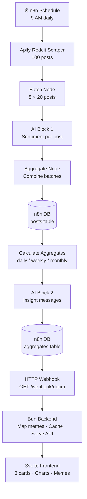

# Wave 4: Integration + Deployment

## Status
- **Dependencies**: Waves 1-3 must be complete (or at least critical tasks)
- **Agent**: Any agent can pick this up after Waves 1-3
- **Estimated Time**: 1-2 hours

---

## Overview

This wave integrates all components and prepares for deployment:
- Docker Compose setup (frontend + backend + Redis)
- Backend tests pass
- Frontend builds
- End-to-end testing
- Traefik labels configured
- Documentation

**Key Deliverable**: A working end-to-end system running in Docker Compose.

---

## Architecture

```
┌─────────────────────────────────────────────┐
│                  TRAEFIK                     │
│            (Reverse Proxy)                  │
└─────────────────────────────────────────────┘
                    │
        ┌───────────┴───────────┐
        │                       │
┌───────▼────────┐      ┌───────▼────────┐
│    FRONTEND    │      │    BACKEND     │
│   (Svelte)     │      │    (Bun)       │
│   Port 80      │──────►│   Port 3000    │
└────────────────┘      └────────────────┘
                               │
                      ┌────────▼────────┐
                      │   N8N WEBHOOK   │
                      │   (External)     │
                      │                  │
                      └─────────────────┘

┌─────────────────────────────────────────────┐
│         n8n (External Service)              │
│   - Runs daily at9 AM                      │
│   - Updates internal DB                    │
│   - Exposes HTTP webhook                    │
└─────────────────────────────────────────────┘
```

**No Supabase** - n8n handles data storage.

---

## Tasks

### Task 31: Project Root Files
- [ ] **Status**: Pending

**What to do**:
- Create `.gitignore` at project root
- Create `docker-compose.yml` at project root
- Create `README.md` with setup instructions

**Files**:
- `.gitignore`
- `docker-compose.yml`
- `README.md`

**`.gitignore`**:
```gitignore
# Environment variables
.env
*.env.local

# Dependencies
node_modules/
bun.lockb

# Build outputs
dist/
build/
*.log

# OS files
.DS_Store
Thumbs.db

# IDE
.vscode/
.idea/
*.swp
*.swo

# Secrets
secrets/
*.pem
*.key

# Docker
.docker/

# n8n
n8n-data/
```

**Acceptance Criteria**:
- [ ] `.gitignore` exists with `.env` entry
- [ ] `docker-compose.yml` exists
- [ ] `README.md` exists

---

### Task 32: Docker Compose Setup
- [ ] **Status**: Pending

**What to do**:
- Create `docker-compose.yml` (frontend + backend)
- Configure Traefik labels
- Set up networking

**docker-compose.yml**:
```yaml
version: '3.8'

services:
  frontend:
    build:
      context: ./frontend
      dockerfile: Dockerfile
    image: doomscroll-frontend:latest
    container_name: doomscroll-frontend
    env_file:
      - ./frontend/.env
    networks:
      - app-network
      - proxy
    labels:
      - "traefik.enable=true"
      - "traefik.docker.network=proxy"
      - "traefik.http.routers.frontend.rule=Host(`doomscroll.paulvinueza.dev`)"
      - "traefik.http.routers.frontend.entrypoints=websecure"
      - "traefik.http.routers.frontend.tls.certresolver=myresolver"
      - "traefik.http.services.frontend.loadbalancer.server.port=80"
      - "traefik.http.routers.frontend-http.entrypoints=web"
      - "traefik.http.routers.frontend-http.rule=Host(`doomscroll.paulvinueza.dev`)"
      - "traefik.http.routers.frontend-http.middlewares=redirect-to-https"
      - "traefik.http.middlewares.redirect-to-https.redirectscheme.scheme=https"

  api:
    build:
      context: ./backend
      dockerfile: Dockerfile
    image: doomscroll-backend:latest
    container_name: doomscroll-backend
    env_file:
      - ./backend/.env
    environment:
      - NODE_ENV=production
      - PORT=3000
    networks:
      - app-network
      - proxy
    labels:
      - "traefik.enable=true"
      - "traefik.docker.network=proxy"
      - "traefik.http.routers.api.rule=(Host(`doomscroll.paulvinueza.dev`) || Host(`www.doomscroll.paulvinueza.dev`)) && (PathPrefix(`/api`) || PathPrefix(`/memes`) || PathPrefix(`/health`))"
      - "traefik.http.routers.api.entrypoints=websecure"
      - "traefik.http.routers.api.tls.certresolver=myresolver"
      - "traefik.http.services.api.loadbalancer.server.port=3000"
      - "traefik.http.routers.api-http.entrypoints=web"
      - "traefik.http.routers.api-http.rule=Host(`doomscroll.paulvinueza.dev`) && (PathPrefix(`/api`) || PathPrefix(`/memes`) || PathPrefix(`/health`))"
      - "traefik.http.routers.api-http.middlewares=redirect-to-https"

networks:
  app-network:
    driver: bridge
  proxy:
    external: true
```

**`.env.example` (for Docker Compose)**:
```bash
# Backend environment
N8N_WEBHOOK_URL=http://your-n8n-instance/webhook/doom
WEBHOOK_SECRET=your_webhook_secret_here
PORT=3000

# Frontend environment
VITE_API_URL=https://doomscroll.paulvinueza.dev

# Traefik
CERT_RESOLVER=myresolver
```

**Acceptance Criteria**:
- [ ] `docker-compose up -d` runs all services
- [ ] Backend accessible on port 3000
- [ ] Frontend accessible on port 80
- [ ] Traefik labels configured
- [ ] `.gitignore` includes `.env`

---

### Task 33: Backend Tests Pass
- [ ] **Status**: Pending

**What to do**:
- Run `bun test` in backend
- Ensure all tests pass
- Fix any failures

**Commands**:
```bash
cd backend
bun test
```

**Acceptance Criteria**:
- [ ] `bun test` passes
- [ ] No test failures
- [ ] All tests green

**Notes**:
- Mock n8n webhook for tests
- Use environment variable for webhook URL in tests

---

### Task 34: Frontend Builds
- [ ] **Status**: Pending

**What to do**:
- Run `npm run build` in frontend
- Ensure build succeeds
- Check build output

**Commands**:
```bash
cd frontend
npm run build
```

**Acceptance Criteria**:
- [ ] `npm run build` succeeds
- [ ] Build output in `dist/`
- [ ] No build errors

---

### Task 35: Workflow Runs End-to-End
- [ ] **Status**: Pending

**What to do**:
- Trigger n8n workflow manually
- Verify Apify scrapes 100 posts
- Verify AI analyzes all posts (or handles errors)
- Verify n8n database stores posts
- Verify n8n database stores aggregates
- Check data via HTTP webhook

**Test Scenarios**:
1. **Happy Path**: All 5 AI batches succeed
   - Expected: 100 posts analyzed, data stored
2. **Partial Failure**: 2/5 AI batches fail
   - Expected: 60 posts analyzed, errors logged, Discord notified
3. **Re-run Workflow**: Run same day twice
   - Expected: Posts UPSERTed (no duplicates), aggregates UPSERTed

**Commands**:
```bash
# In n8n dashboard:
# 1. Click "Execute Workflow"
# 2. Monitor execution
# 3. Check HTTP webhook response

# Test webhook
curl https://your-n8n-instance/webhook/doom
```

**Acceptance Criteria**:
- [ ] Workflow runs successfully
- [ ] Posts stored in n8n database
- [ ] Aggregates stored in n8n database
- [ ] HTTP webhook returns data
- [ ] No duplicates on re-run

**Evidence to Capture**:
- [ ] Screenshot of n8n execution
- [ ] Screenshot of HTTP webhook response
- [ ] Screenshot of n8n database tables

---

### Task 36: API Returns Data
- [ ] **Status**: Pending

**What to do**:
- Test `GET /api/doom` endpoint
- Verify JSON structure
- Check data matches n8n webhook
- Verify memes mapped correctly
- Verify evidence phrases included

**Commands**:
```bash
# Test backend directly
curl http://localhost:3000/api/doom

# Or via Docker
docker exec -it doomscroll-backend curl http://localhost:3000/api/doom
```

**Expected Response**:
```json
{
  "daily": {
    "sentiment": 45,
    "status": "bearish",
    "message": "The market is COOKED...",
    "meme": "this_is_fine.jpg",
    "evidence": ["layoffs ↑ 300%", "70% mention ghosting"],
    "top_posts": [...]
  },
  "weekly": {...},
  "monthly": {...},
  "history": [...]
}
```

**Acceptance Criteria**:
- [ ] Endpoint returns correct JSON
- [ ] Data matches n8n webhook
- [ ] Memes mapped correctly (sentiment → meme file)
- [ ] Top posts have full details (not just IDs)
- [ ] Evidence phrases included

---

### Task 37: Frontend Displays Data
- [ ] **Status**: Pending

**What to do**:
- Open frontend in browser
- Verify 3 cards render
- Check memes display
- Check charts render
- Check evidence phrases display
- Check top posts render

**Commands**:
```bash
# Start frontend
docker-compose up -d frontend

# Open browser
open https://doomscroll.paulvinueza.dev
```

**Acceptance Criteria**:
- [ ] Frontend displays 3 cards
- [ ] Daily card: sentiment + meme + message + evidence + posts
- [ ] Weekly card: sentiment + meme + message + evidence + chart
- [ ] Monthly card: sentiment + meme + message + evidence + chart
- [ ] Memes load correctly
- [ ] Charts render properly
- [ ] Evidence phrases display

**Evidence to Capture**:
- [ ] Screenshot of daily card
- [ ] Screenshot of weekly card
- [ ] Screenshot of monthly card
- [ ] Screenshot of charts

---

### Task 38: Create docs/decisions.md
- [ ] **Status**: Pending

**What to do**:
- Create `docs/decisions.md`
- Document architectural decisions
- Explain rationale for each choice

**File**: `docs/decisions.md`

**Content**:
```markdown
# Architecture Decisions

## Why n8n Over Custom Pipeline?
- Visual workflow
- Built-in database storage
- No external database needed (simpler setup)
- Built-in integrations (Apify, HTTP webhooks)
- Scheduling (Cron)
- No custom backend for pipeline

## Why n8n Database Tables?
- Built-in storage (no external DB)
- Persistent across workflow runs
- Simple HTTP webhook for data retrieval
- Free tier compatible
- No need for Supabase setup

## Why Svelte Over React?
- Simpler
- Less code
- Faster builds
- Smaller bundle

## Why Bun Over Node?
- All-in-one (run + test)
- Faster
- Native TypeScript support

## Why Batching AI Calls?
- 20 posts per batch
- 5 calls instead of 100
- Better accuracy
- Manageable cost

## Why Weighted Sentiment?
- Viral posts matter more
- Reflects real market sentiment
- Popular opinions have more impact

## Why Memes as Visual Insights?
- Easier to understand than numbers
- Memorable and shareable
- Emotional context

## Why Memes NOT Stored in DB?
- Memes mapped dynamically in backend
- Allows changing memes without data migration
- No need to update historical data
- Simpler schema

## Why Top Posts as IDs?
- Avoid duplicated data in aggregates
- Backend JOINs with posts table (or n8n webhook)
- Keeps aggregates table small
- Flexible for future changes

## Why UPSERT on Posts?
- Prevents duplicates on re-run
- Allows testing without breaking data
- Updates existing posts (upvotes may change)

## Why ONE Aggregates Table?
- ONE upsert per day (simpler)
- JSON storage is fast
- No joins needed
- Easy to query

```

**Acceptance Criteria**:
- [ ] File exists
- [ ] All decisions documented
- [ ] Rationale clear

---

### Task 39: Create docs/business-impact.md
- [ ] **Status**: Pending

**What to do**:
- Create `docs/business-impact.md`
- Document cost analysis and business reasoning for key decisions
- Include concrete numbers where possible

**File**: `docs/business-impact.md`

**Content**:
```markdown
# Business Impact & Cost Analysis

## Renting vs. Building a Scraper

### Build-it-yourself cost
- Residential proxy service: ~$50–150/month (required to reliably scrape Reddit)
- Developer time to build and maintain: ongoing — Reddit actively changes their
  anti-bot measures, breaking scrapers on a rolling basis
- Debugging proxy rotation, rate limits, and Reddit's evolving HTML is
  undifferentiated work that doesn't ship product

### Apify managed scraper cost
- ~$40/month for a maintained Reddit scraper actor with a high marketplace rating
- Proxies included — no separate proxy account needed
- Runs once per day: ~$1.30/run amortized
- Risk: third-party dependency. Mitigated by the actor's track record and Apify's SLA

### Decision: rent, don't build
$40/month buys reliability, proxy management, and zero maintenance burden.
A custom scraper would cost more in developer hours within the first week alone.

---

## Why n8n for Orchestration?

- **Swappable components**: The workflow is modular. Switching scrapers or AI providers
  means changing one node — not rewriting application code
- **No AI vendor lock-in**: If a cheaper or better model releases, swap the AI node.
  The rest of the pipeline is untouched
- **Replaces 3 services in one**: built-in scheduling (cron), database, and HTTP webhook
  endpoint — no separate cron service, no external DB, no custom API server for the pipeline
- **Self-hostable**: no per-seat or usage-based cloud pricing

---

## Total Monthly Cost

| Item | Cost |
|------|------|
| Apify Reddit scraper | ~$40/month |
| n8n (self-hosted) | $0 |
| Bun backend (self-hosted) | $0 |
| Svelte frontend (self-hosted) | $0 |
| VPS (shared with existing services) | ~$0 marginal |
| **Total** | **~$40/month** |

Compare to a cloud-hosted equivalent:
- Managed scraping + proxies: $50–150/month
- Vercel/Render for frontend + backend: $20–40/month
- Managed DB (Supabase, PlanetScale): $25+/month
- **Equivalent cloud stack: ~$100–200/month**

Self-hosting reduces ongoing infrastructure cost by ~60–80%.
```

## Spec-Driven Development

Rather than coding everything manually, this project was built using a
spec-driven approach: detailed wave plans were written upfront, then executed
by AI agents working in parallel.

### Time comparison
| Approach | Estimated time |
|----------|---------------|
| Manual implementation | ~8–13 hours (per plan estimate) |
| Writing the spec | ~2–3 hours |
| Agent execution | ~1–2 hours supervised |
| **Total (spec-driven)** | **~3–5 hours** |

### How it works
- Each wave file is a precise, machine-readable spec: exact code snippets,
  acceptance criteria, file paths, and dependency order
- Agents pick up tasks autonomously — no ambiguity means no back-and-forth
- Wave 1 and Wave 3 run in parallel, compressing wall-clock time further
- The spec also doubles as documentation — no separate write-up needed

### Why this matters for a business
- Faster iteration: a new feature goes from idea → spec → running code in hours
- Reproducible: any agent (or developer) can pick up a wave file and execute it
  without context from the original author
- Auditable: every decision is documented before a line of code is written,
  making reviews and handoffs straightforward

**Acceptance Criteria**:
- [ ] File exists at `docs/business-impact.md`
- [ ] Cost table included with real numbers
- [ ] Build vs. rent analysis documented
- [ ] n8n modularity argument documented
- [ ] Self-hosting cost comparison included
- [ ] Spec-driven development section included with time comparison

---

### Task 40: Create README.md
- [ ] **Status**: Pending

**What to do**:
- Create a clean, visual `README.md` at the project root
- Include project description, live demo link, and stack badges
- Include architecture diagram (ASCII or image)
- Include setup/deployment instructions
- Include screenshots or GIF of the UI

**Content**:
```markdown
# Doomscroll 📉

> AI-powered CS job market sentiment tracker. Reddit posts → sentiment analysis → memes.

[Live Demo badge] [Stack badges: n8n | Bun | Svelte | Apify | Docker]

## What it does

Monitors Reddit (r/cscareerquestions, r/jobs, r/layoffs) daily. Analyzes 100 posts
with AI sentiment scoring, generates weighted daily/weekly/monthly aggregates,
and displays results as memes + evidence phrases.

## Screenshots

[Daily card screenshot]
[Weekly/monthly cards with charts]

## Architecture



## Stack

| Layer | Tech |
|-------|------|
| Scraping | Apify Reddit Scraper |
| Pipeline | n8n (workflow + built-in DB) |
| AI | n8n AI nodes |
| Backend | Bun + TypeScript |
| Frontend | SvelteKit + Chart.js |
| Deployment | Docker Compose + Traefik |

## Setup

[.env setup, docker-compose up instructions]
```

**Files**:
- `README.md` (project root)
- Add screenshots to `.sisyphus/evidence/` for README use

**Acceptance Criteria**:
- [ ] README exists at project root
- [ ] Includes project description and purpose
- [ ] Includes stack table or badges
- [ ] Includes setup/deployment instructions
- [ ] Includes at least one screenshot or UI mockup
- [ ] Includes architecture overview

---

## After Wave Completion

### Checklist
- [ ] All tasks marked complete
- [ ] `docker-compose up -d` works
- [ ] Backend tests pass
- [ ] Frontend builds
- [ ] Workflow runs end-to-end
- [ ] API returns data
- [ ] Frontend displays data
- [ ] Traefik routes correctly
- [ ] Documentation complete
- [ ] `.gitignore` includes `.env`

### Next Wave
Move to **Wave Final: Verification** - needs all Waves 1-4 complete.

---

## Evidence Files
Save evidence to `.sisyphus/evidence/wave-4-*/`:
- `wave-4-task-35-workflow-execution.png`
- `wave-4-task-36-api-response.json`
- `wave-4-task-37-frontend-display.png`